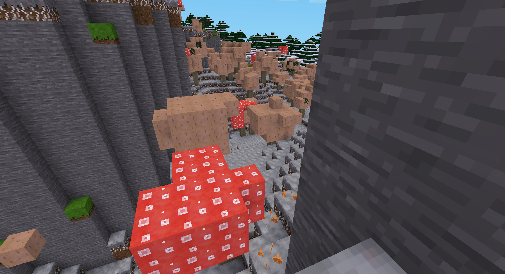
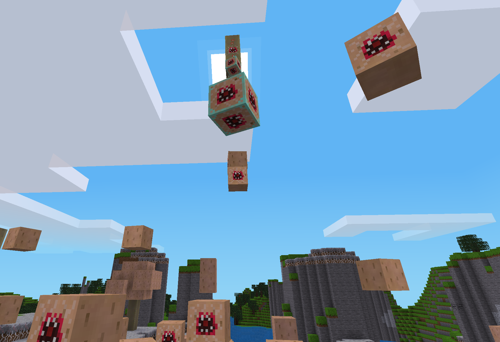
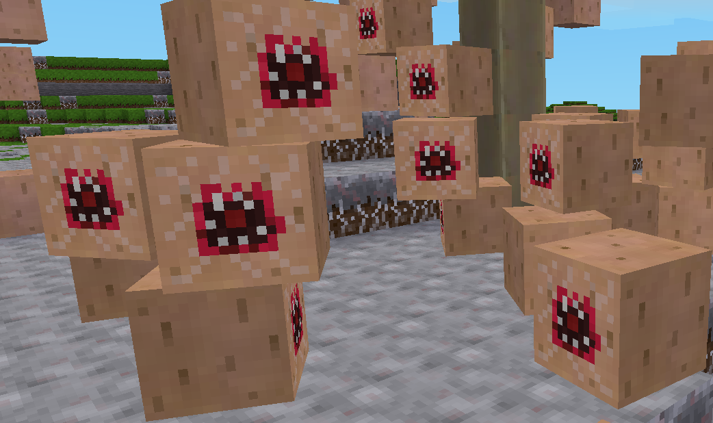

# pilzmod

pilzmod is a minetest mod that adds a spreading spawnable mushroom biome into the game, overgrown with myzelium and filled with giant versions of the mushroom we all know from minetest game, their smaller cousins, and eight new types of small mushroom, as well as monsters and a boss.

As opposed to „normal“ minetest biomes, mushroom biomes don‘t generate naturally into the world. Instead, you must craft a myzelium block, place it, and watch the mushroom biome slowly spread from it, gradually consuming the world and turning it into a mushroom hell. The only way of stopping it is to find a mushroom boss – a entity you probably won‘t find until the biome reached considerable size – and get the antidote from it, which you can use to seal off the mushroom biome and stop it from spreading further.

Killing the boss also drops a pretty trophy – so will you risk the consumption of your world for the honor of a worthy adventurer, or will you refrain from spawning the biome like a coward?

Some screenshots of the mod:

 

Continue reading [here](https://github.com/phseiff/pilzmod/blob/main/documentation/pilzmod.pdf), or in documentation/pilzmod.pdf if you are reading this in a local copy of the project.
